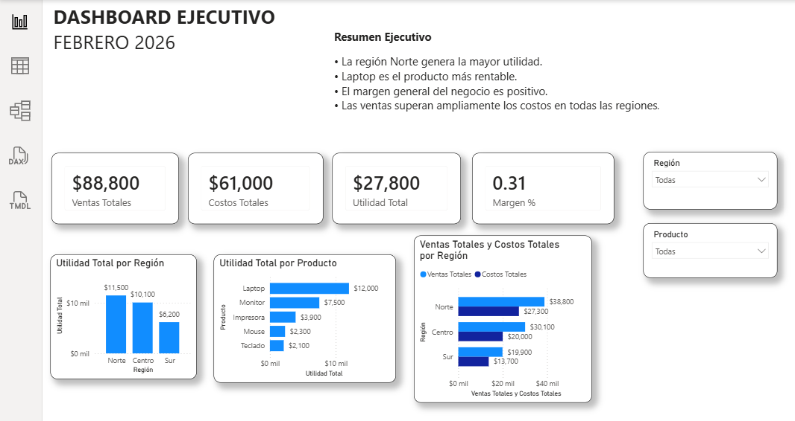

# Dashboard Ejecutivo en Power BI

## Descripción
Dashboard ejecutivo para monitorear ventas, costos, utilidad y margen.

## Herramientas utilizadas
- Power BI
- Power Query
- DAX
- Excel

## KPIs
- Ventas Totales
- Costos Totales
- Utilidad Total
- Margen %

## Visualizaciones
- Utilidad por Región
- Utilidad por Producto
- Ventas vs Costos por Región

## Hallazgos
- Norte es la región más rentable.
- Laptop es el producto con mayor utilidad.
- El margen general del negocio es positivo.

## Vista previa

